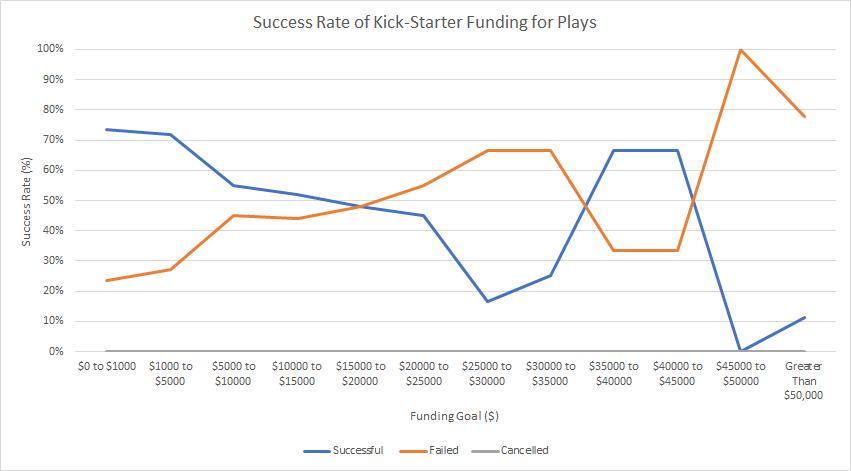
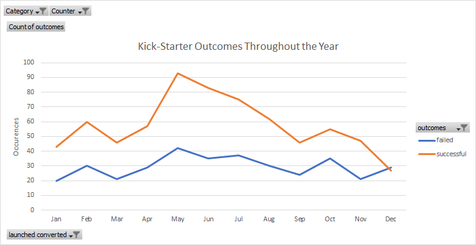
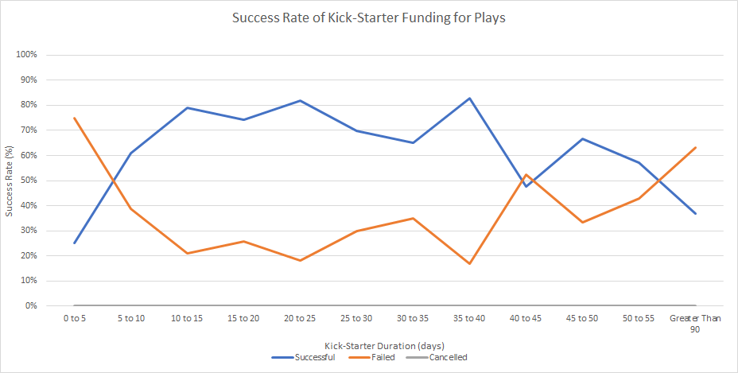

# Kick_Starter_Analysis
 
### Challenge 1 
Three analyses were performed to determine the impact that certain variables had on the success rate of a Kick-Starter campaign for a Play. Each campaign currently possess one of four status' ranging from successful, failed, cancelled and live. All cases were filtered to exclude the live cases which allows us to perform an analysis on all completed cases. Additionally, only the outcomes related to Plays were analyzed which narrows down the data to the areas of question. 

First, the camapaign goal size was analyzed. The results from this weren't consistent as there were outliers preventing a conclusive reccomendation, but looking at the general trend and taking into consideration the outliers, the higher the investment goal, the lower the success rate a campaign would have. The image below shows a visual representation of the success rate as a function of the investment goal size. 

Secondly, the launch date was analyzed. It was determined that the greatest success rate was found in the month of May. The image below shows a visual representation of the success rate over the year. 

Thirdly, the duration of the campaign was analyzed. Similar results were obtained to that of the campaign goal size. There are outliers which prevent a concrete reccomendation, but from observing the general trend, a campaign length of 5 to 40 days results in the highest success rate. The image below shows a visual representation of the success rate versus campaign duration. 

To obtain the highest change of having a successful Kick-Starter campaign for a Play, the duration of the campaign should be between 5-40 days, the goal should be less than $20,000, and the campaign should be launched in the month of May. To increase the relative accuracy of this analysis, the data could be further filtered into specific categories allowing us to relate the success of themes to their popularity within the public. 

